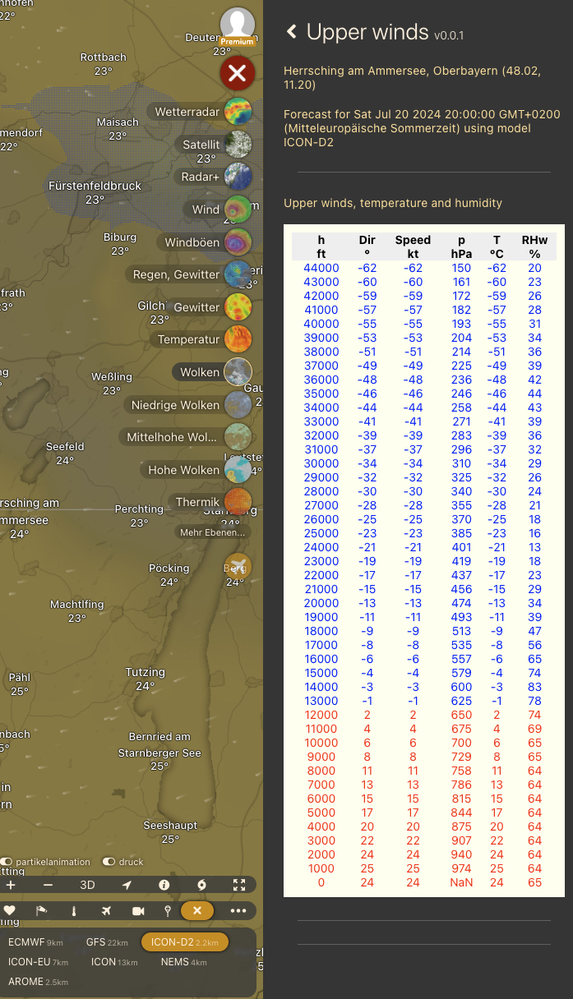

# Windy Plugin - Föhn Cross Sections - Alps

Plugin to determine the Foehn potential along different cross sections in the alps

## Please note:

Due to Windy security restrictions, the plugin is only available on the desktop versions of Windy.

## Installation:

To be done

* To install an update, delete the existing plugin from Windy and load the latest version.

## Basic usage

In the upper part of the right hand panel choose a cross section.
The map view focusses at the chosen cross section and denotes the wind at 700  hPa in the middle between the ends of the cross section.
On the right hand panel the pressure difference between the two locations is shown.

