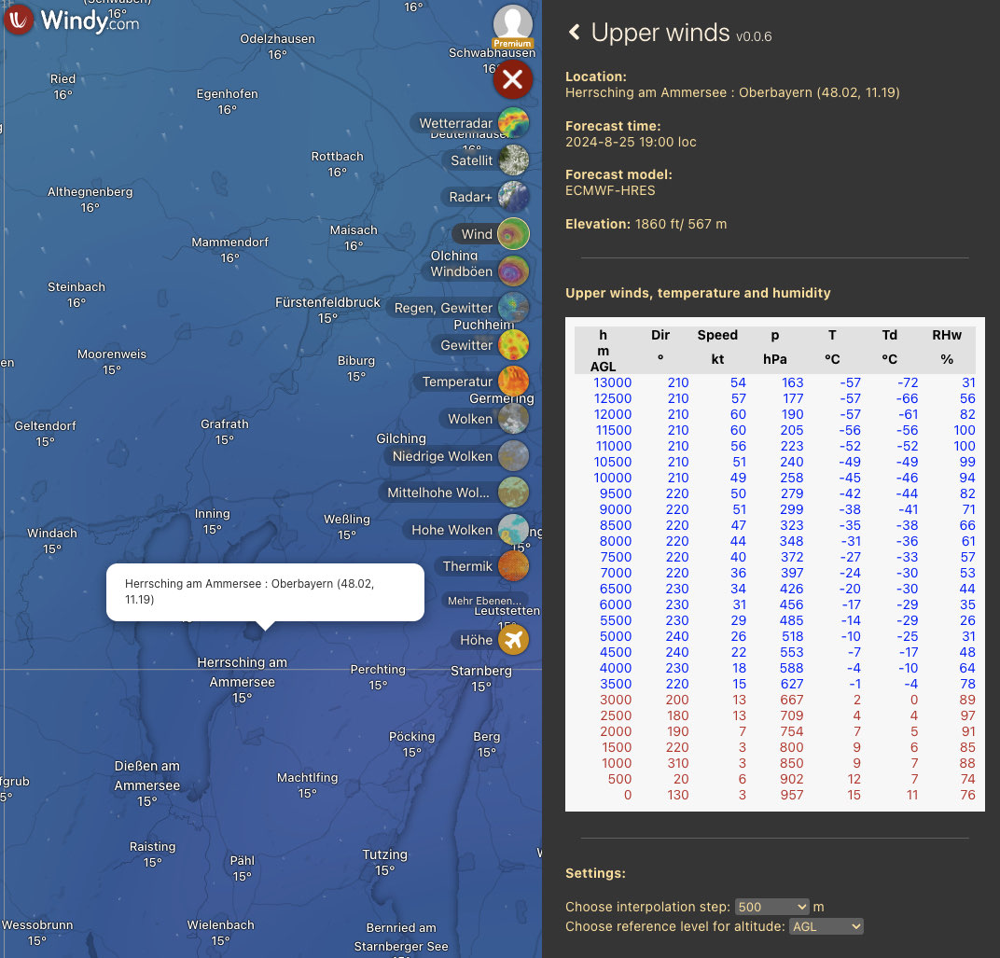

# Windy Plugin - Upper winds

Plugin to get upper winds, temperature and humidity interpolated to human readable heights.

Works on desktop (right-hand panel) as well as on mobile devices (fullscreen panel).

## Basic usage

* Click or tap on the map to show upper winds, temperature and humidity for the selected position. On mobile you can also long-press the map and choose "Upper winds" from the context menu.
* The marker on the map can be dragged to fine-tune the position.
* The forecast time can be changed with the timeslider or with the ‹ › buttons next to "Forecast time", which step through the forecast hours of the selected model. The buttons are especially handy on mobile, where the panel covers the timeline.
* All available forecast models in the given area of interest can be used.
* The interpolation step and the reference level for the altitude (AGL/AMSL) can be selected in the settings below the table.
* By selecting a lower and upper altitude the mean wind speed and direction for that layer are calculated. The result is shown in the info block at the top as well as next to the input fields.

## Good to know

* Units in the table follow your individual Windy settings (ft/m, kt/km/h/m/s/mph, °C/°F).
* Temperature coloring: values above freezing are red, the freezing level is green, values below freezing are blue.
* The table is scrolled to the near-ground values by default; scroll up inside the table for higher levels.
* On mobile, slide the panel to its half position to see the map and the most important values at a glance; settings are hidden in this view and reappear in fullscreen.
* If a non-forecast overlay (satellite, radar) is active, the plugin switches the overlay to wind and shows a short notice.

## Installation

* Install the plugin from the Windy plugins gallery at [windy.com/plugins](https://www.windy.com/plugins).
* Windy will notify you when an update is available.

